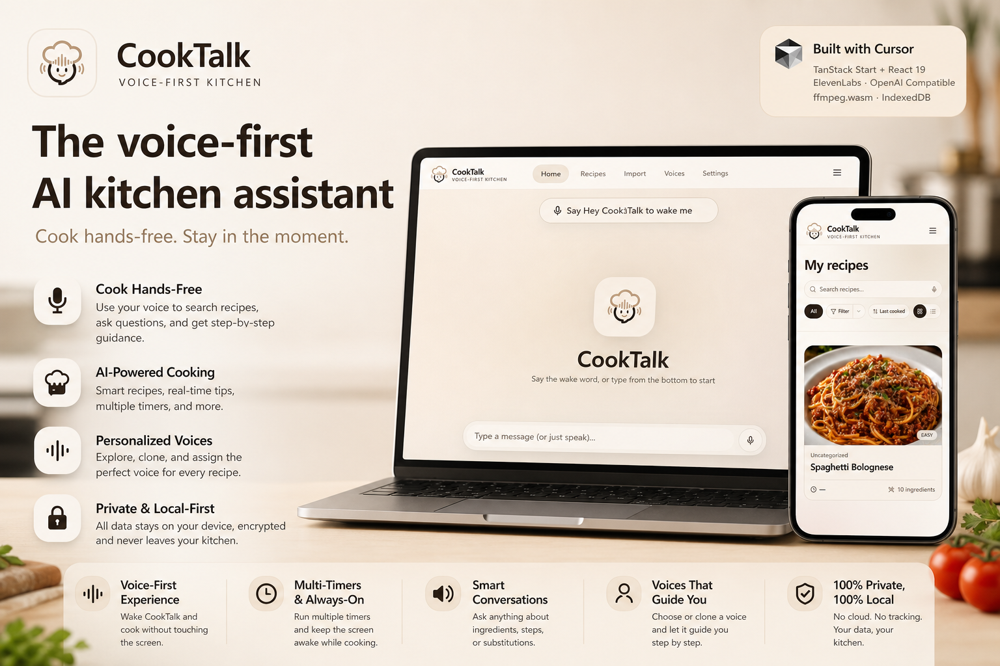
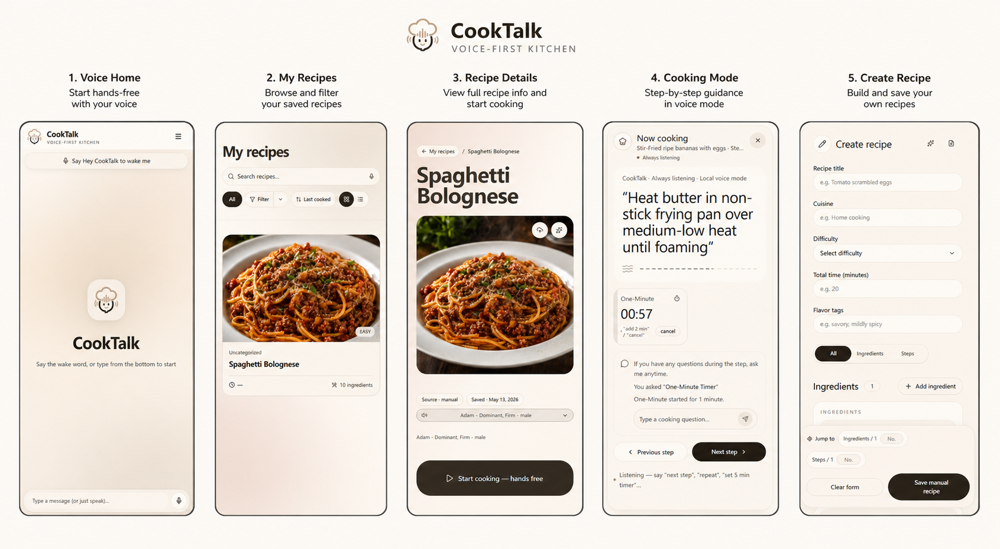

<h1 align="center">CookTalk</h1>

<p align="center">
  A privacy-first, bilingual, voice-driven smart kitchen assistant.
</p>

<p align="center">
  
</p>

<p align="center">
  <a href="README.zh-CN.md">简体中文</a>
  ·
  <a href="#features">Features</a>
  ·
  <a href="#quick-start">Quick Start</a>
  ·
  <a href="#configuration">Configuration</a>
  ·
  <a href="#deployment">Deployment</a>
</p>

---

## Project Overview

CookTalk integrates recipes, cooking videos, voice, timers, and AI chat into a quiet and handy kitchen workstation. It is designed for real cooking scenarios: you can search for recipes by voice, import cooking videos as structured recipes, follow step-by-step guidance in cooking mode, ask for ingredient substitutions mid-cooking, and run multiple timers simultaneously.

The app follows a local-first approach. Recipes, settings, drafts, and API credentials are stored locally in the browser by default, and sensitive info is protected by IndexedDB with an AES-GCM-based credential protection mechanism.

## Preview

<p align="center">
  
</p>

## Key Highlights

| Voice-First Kitchen                                          | Privacy-First Local Storage                                     | AI Recipe Workflow                                          |
| ------------------------------------------------------------ | --------------------------------------------------------------- | ----------------------------------------------------------- |
| Supports wake word, manual activation, contextual commands, page navigation, scrolling, and form entry. | Recipes, settings, credentials, timers, drafts, and sound caches are stored locally in the browser by default. | Supports idea chats, video-to-recipe structuring, AI cover generation, and saving recommended recipes. |

## Feature Overview

<table>
  <tr>
    <td width="50%"><strong>🎙 Global Voice Control</strong><br />Navigate pages, scroll, fill forms, and issue contextual cooking commands via wake word or manual activation.</td>
    <td width="50%"><strong>🍳 Guided Cooking Mode</strong><br />Step-by-step recipe instructions read aloud; supports pause, resume, repeat, previous/next step, screen keep-awake, and assigning exclusive voice per recipe.</td>
  </tr>
  <tr>
    <td><strong>⏱ Multiple Parallel Timers</strong><br />Create, extend, cancel, and check multiple timers during cooking—ideal for dishes with parallel steps.</td>
    <td><strong>🎬 Video to Recipe</strong><br />Import cooking videos, extract audio with ffmpeg.wasm, transcribe and organize into ingredients, steps, tags, and cover images.</td>
  </tr>
  <tr>
    <td><strong>🧠 AI Recipe Dialogs</strong><br />Search local recipes first, request new ideas, open recipe cards, save recommendations, and directly enter guided cooking mode.</td>
    <td><strong>🗣 Voice Library Management</strong><br />Browse ElevenLabs voices, preview samples, manage cloned voices, and assign unique voices to different recipes.</td>
  </tr>
  <tr>
    <td><strong>🖼 Recipe Covers</strong><br />Upload your own cover image or generate AI covers from recipe prompts.</td>
    <td><strong>🌏 Bilingual UI (EN & ZH)</strong><br />Built-in English and Chinese, with more natural interface prompts based on current language.</td>
  </tr>
</table>

## Tech Stack

| Layer         | Technologies                                                             |
| ------------- | ------------------------------------------------------------------------ |
| Application   | TanStack Start, TanStack Router, Vite 7                                  |
| UI            | React 19, Tailwind CSS 4, Radix UI, shadcn style components, Lucide Icons|
| State & Data  | Zustand, TanStack Query, Dexie, Dexie React Hooks                        |
| Local Storage | IndexedDB / Dexie, local key protection using Web Crypto AES-GCM         |
| AI & Voice    | ElevenLabs API, OpenAI-compatible text & image interfaces                |
| Media         | ffmpeg.wasm for in-browser video/audio processing                        |
| i18n          | i18next, react-i18next                                                   |
| Quality       | TypeScript, ESLint, Prettier                                             |

## Project Structure

```text
CookTalk/
├─ public/
│  ├─ logo.png
│  ├─ logo-dark.png
│  ├─ timer-worker.js
│  └─ ffmpeg/
├─ server/
│  └─ railway.mjs
├─ src/
│  ├─ components/       # Common UI and shell components
│  ├─ hooks/            # Voice, timers, mobile, and ElevenLabs hooks
│  ├─ lib/              # DB, crypto, LLM, voice, i18n, and utilities
│  ├─ locales/          # English & Chinese translation files
│  ├─ routes/           # TanStack Router pages
│  ├─ stores/           # Zustand stores
│  ├─ router.tsx
│  └─ client.tsx
├─ package.json
├─ vite.config.ts
├─ railway.json
└─ wrangler.jsonc
```

## Quick Start

### Requirements

- Node.js **22.12.0 or higher**
- npm, Bun, or another compatible package manager
- A modern browser supporting Web Crypto, IndexedDB, microphone access, and Wake Lock is recommended

### Install Dependencies

```bash
npm install
```

Or use Bun:

```bash
bun install
```

### Run Locally

```bash
npm run dev
```

Open the local URL output by Vite, typically `http://localhost:5173`.

### Production Build

```bash
npm run build
npm run preview
```

## Common Scripts

| Script               | Description                         |
| -------------------- | ----------------------------------- |
| `npm run dev`        | Start the Vite development server   |
| `npm run build`      | Build the production bundle         |
| `npm run build:dev`  | Build in development mode           |
| `npm run preview`    | Preview production build locally    |
| `npm run start`      | Start the Railway Node server       |
| `npm run lint`       | Run ESLint                         |
| `npm run format`     | Format files with Prettier          |

## Configuration

Most runtime credentials are configured in-app via **Settings → API Keys** rather than environment variables. CookTalk encrypts/obfuscates these values using AES-GCM and stores them locally in your browser.

| Config                       | Purpose                                | Default/Notes                   |
| ---------------------------- | -------------------------------------- | ------------------------------- |
| ElevenLabs API Key           | Voice synthesis, preview, clone, TTS   | Full voice experience requires this |
| LLM Endpoint                 | OpenAI-compatible text model endpoint  | `https://api.openai.com/v1`     |
| LLM Model                    | Recipe chat, structuring, Q&A, enhance| `gpt-4o-mini`                   |
| Image Endpoint / Key / Model | AI recipe cover generation             | Default image model: `gpt-image-1.5` |

For server deployment, typically only the following process variables are needed:

| Variable | Description                                  | Default    |
| -------- | -------------------------------------------- | ---------- |
| `PORT`   | HTTP port used by `server/railway.mjs`       | `3000`     |
| `HOST`   | HTTP listening address                       | `0.0.0.0`  |

## Browser Permissions

CookTalk may request the following permissions:

- **Microphone**: For voice commands and related flows
- **Wake Lock**: To keep the screen on during guided cooking
- **Local Storage / IndexedDB**: To store recipes, settings, drafts, timers, and sound caches

## Roadmap

- Cloud sync and multi-device recipe sharing
- More voice command packs and cooking scenarios
- Nutrition analysis and shopping list integration
